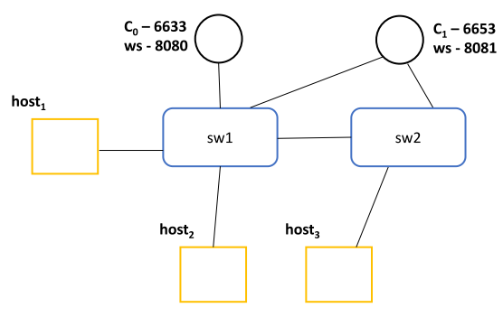
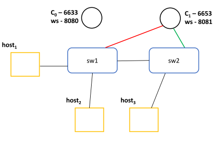
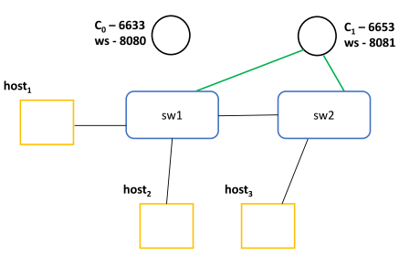

# Assignment Fac Simile

L'obiettivo di questo assignment è quello di realizzare una topologia di rete SDN composta da tre host, due switch e due controller.



Nella topologia abbiamo due switch, 2 controller e 3 host. C0 è inizialmente collegato solo a sw1 mentre C1 a entrambi gli switch.
Lo step 1 chiede di far passare nello stato di SLAVE il controller C1 per lo switch 1: dobbiamo utilizzare il comando che effettua il cambiamento.

## STEP 0: AVVIO DEI CONTROLLER E DELLA TOPOLOGIA
Innanzitutto avviamo i due controller con il proprio Web Service, ciascuno su un proprio terminale. In particolare, per l'avvio del primo controller non specifichiamo alcuna porta di ascolto, in quanto di default usa la 8080, mentre per quanto riguarda il secondo controller ne specifichiamo una diversa, la 8081.

```bash
#Terminale 1
ryu-manager --ofp-tcp-listen-port 6633 simple_switch_13.py ofctl_rest.py
#Terminale 2
ryu-manager --ofp-tcp-listen-port 6653 --wsapi-port 8081 simple_switch_13.py ofctl_rest.py
```
Ci accorgiamo del corretto avvio dei due controller se otteniamo come output una risposta simile alla seguente:
```bash
$ ryu-manager --ofp-tcp-listen-port 6633 simple_switch_13.py ofctl_rest.py

loading app simple_switch_13.py
loading app ofctl_rest.py
loading app ryu.controller.ofp_handler
instantiating app None of DPSet
creating context dpset
creating context wsgi
instantiating app simple_switch_13.py of SimpleSwitch13
instantiating app ofctl_rest.py of RestStatsApi
instantiating app ryu.controller.ofp_handler of OFPHandler
(14374) wsgi starting up on http://0.0.0.0:8080
```
La differenza sarà la porta, che nel secondo controller sarà la 8081.

Ora avviamo la topologia con Mininet, usando il comando:
```bash
$ sudo python 2switch_3host_2ext_cntlr.py
```
Per controllare che la topologia sia correttamente avviata, in un altro terminale possiamo eseguire il comando di <em> show </em>:
```bash
$ sudo ovs-vsctl show

a1352329-9655-4c9a-a0a3-ef9c4566defa
    Bridge "sw2"
        Controller "tcp:127.0.0.1:6653"
            is_connected: true
        fail_mode: secure
        Port "sw2-eth2"
            Interface "sw2-eth2"
        Port "sw2"
            Interface "sw2"
                type: internal
        Port "sw2-eth1"
            Interface "sw2-eth1"
    Bridge "sw1"
        Controller "tcp:127.0.0.1:6633"
            is_connected: true
        Controller "tcp:127.0.0.1:6653"
            is_connected: true
        fail_mode: secure
        Port "sw1"
            Interface "sw1"
                type: internal
        Port "sw1-eth2"
            Interface "sw1-eth2"
        Port "sw1-eth3"
            Interface "sw1-eth3"
        Port "sw1-eth1"
            Interface "sw1-eth1"
    ovs_version: "2.9.8"
```
Notiamo la correttezza in quanto, come previsto, lo switch sw1 è connesso ai due controller, mentre il secondo, sw2, è connesso solo a quello in ascolto sulla porta 6653, e ogni connessione è correttamente stabilita (is_connected: true).
Ora analizziamo lo stato di default dei due controller creati.
```bash
$ sudo ovs-vsctl list controller

_uuid               : d6495dc4-1516-45c5-b2e1-138b7c789282
connection_mode     : []
controller_burst_limit: []
controller_rate_limit: []
enable_async_messages: []
external_ids        : {}
inactivity_probe    : []
is_connected        : true
local_gateway       : []
local_ip            : []
local_netmask       : []
max_backoff         : []
other_config        : {}
role                : other
status              : {sec_since_connect="159", state=ACTIVE}
target              : "tcp:127.0.0.1:6653"

_uuid               : b53dc4e5-18bc-4615-b495-ade769d8c289
connection_mode     : []
controller_burst_limit: []
controller_rate_limit: []
enable_async_messages: []
external_ids        : {}
inactivity_probe    : []
is_connected        : true
local_gateway       : []
local_ip            : []
local_netmask       : []
max_backoff         : []
other_config        : {}
role                : other
status              : {sec_since_connect="160", state=ACTIVE}
target              : "tcp:127.0.0.1:6653"

_uuid               : 5221bd12-bf78-4bcc-bcff-6673bb22dee9
connection_mode     : []
controller_burst_limit: []
controller_rate_limit: []
enable_async_messages: []
external_ids        : {}
inactivity_probe    : []
is_connected        : true
local_gateway       : []
local_ip            : []
local_netmask       : []
max_backoff         : []
other_config        : {}
role                : other
status              : {sec_since_connect="160", state=ACTIVE}
target              : "tcp:127.0.0.1:6633"
```

Da questo lungo output possiamo notare le tre connessioni, rispettivamente, ovvero una tra C0 e sw1, una tra C1 e sw1 e una tra C1 e sw2.
I ruoli, come previsto, sono impostati in EQUAL, ovvero <em> other </em> nella sintassi di OpenVSwitch.

## STEP 1-2-3: CAMBIO DEI RUOLI NEI CONTROLLER
L'obiettivo ora è quello di mandare dei messaggi ai controller per sollecitare un cambio di ruolo per i rispettivi switch:
1Il controller C1 dovrà assumere ruolo di SLAVE per lo switch sw1, il ruolo di MASTER per lo switch sw2 mentre il controller C0 il ruolo di MASTER per lo switch sw1.

Definiamo ora i messaggi json da inviare per "triggerare" i cambi di ruolo:
1. Il file changeToMaster.json permette di cambiare il ruolo a MASTER per lo switch con datapath id pari ad 1
2. Il file changeToMaster2.json permette di cambiare il ruolo a MASTER per lo switch con datapath id pari ad 2
2. Il file changeToMaster2.json permette di cambiare il ruolo a SLAVE per lo switch con datapath id pari ad 1
 ```json
//changeToMaster.json
{
    "dpid": 1,
    "role": "MASTER"
}
//changeToMaster2.json
{
    "dpid": 2,
    "role": "MASTER"
}
//changeToSlave.json
{
    "dpid": 1,
    "role": "SLAVE"
}
 ```

Per sollecitare il cambio di ruolo in C0 per sw1 e in C1 per sw2 procediamo all'invio di questi messaggi ai Web Service dei due controller, in ascolto sulle rispettive porte.
 ```bash
 #Cambio di ruolo per il controller C1 rispetto allo switch sw1
$ curl -d "@changeToSlave.json" -X POST http://localhost:8081/stats/role
 #Cambio di ruolo per il controller C0 rispetto allo switch sw1
$ curl -d "@changeToMaster.json" -X POST http://localhost:8080/stats/role
 #Cambio di ruolo per il controller C1 rispetto allo switch sw2
$ curl -d "@changeToMaster2.json" -X POST http://localhost:8081/stats/role
  ```

Possiamo verificare lo stato corrente dei controller effettuando una semplice richiesta GET ai Web Service dei rispettivi controller, in cui possiamo notare come output i ruoli che ci aspettavamo.
 ```bash
#C0 su sw1
$ curl -X GET http://localhost:8080/stats/role/1
	{"1": [{"generation_id": 0, "role": "MASTER"}]}

#C1 su sw2
$ curl -X GET http://localhost:8081/stats/role/2
	{"2": [{"generation_id": 0, "role": "MASTER"}]}

#C1 su sw1
$ curl -X GET http://localhost:8081/stats/role/1
	{"1": [{"generation_id": 0, "role": "SLAVE"}]}
```

## STEP 4: TENTATIVO DI CONNESSIONE
Ora che la topologia è stata alterata, proviamo ad effettuare un comando di ping tra l'host1 e l'host2, analizzandone l'output e il comportamento. Eseguiamo quindi il comando ping nel terminale mininet.
```bash
mininet> host1 ping host2

PING 10.0.0.2 (10.0.0.2) 56(84) bytes of data.
64 bytes from 10.0.0.2: icmp_seq=1 ttl=64 time=33.6 ms
64 bytes from 10.0.0.2: icmp_seq=2 ttl=64 time=0.444 ms
64 bytes from 10.0.0.2: icmp_seq=3 ttl=64 time=0.098 ms
64 bytes from 10.0.0.2: icmp_seq=4 ttl=64 time=0.099 ms
64 bytes from 10.0.0.2: icmp_seq=5 ttl=64 time=0.084 ms
64 bytes from 10.0.0.2: icmp_seq=6 ttl=64 time=0.081 ms
^C
--- 10.0.0.2 ping statistics ---
6 packets transmitted, 6 received, 0% packet loss, time 5071ms
rtt min/avg/max/mdev = 0.081/5.746/33.674/12.490 ms
```
Come previsto, il ping viene effettuato correttamente tra i due host, in quanto essendo C0 il controller MASTER per sw1, ha iniettato le regole di indirizzamento tra host1 e host2. Analizziamo la tabella delle regole presenti in sw1 con il seguente comando:
```bash
$ sudo ovs-ofctl dump-flows sw1

 cookie=0x0, duration=97.089s, table=0, n_packets=6, n_bytes=532, priority=1,in_port="sw1-eth2",dl_src=00:00:00:00:00:02,dl_dst=00:00:00:00:00:01 actions=output:"sw1-eth1"

 cookie=0x0, duration=97.086s, table=0, n_packets=6, n_bytes=532, priority=1,in_port="sw1-eth1",dl_src=00:00:00:00:00:01,dl_dst=00:00:00:00:00:02 actions=output:"sw1-eth2"

 cookie=0x0, duration=247.329s, table=0, n_packets=45, n_bytes=4476, priority=0 actions=CONTROLLER:65535
```
Troviamo due nuove regole, non presenti prima: esse riguardano l'invio di pacchetti da host1 a host2 e viceversa.
Troviamo una serie di informazioni importanti, come il numero di pacchetti inviati, il numero di byte, la porta di ingresso che la regola valuta, il link di livello 2 sia sorgente e destinazione e l'action da effettuare, in questo caso l'indirizzamento sull'interfaccia dell'altro host:
1. L'output sw1-eth1 si riferisce all'interfaccia che porta dallo switch sw1 all'host1, lo possiamo notar bene verificando gli indirizzi MAC di livello 2, ovvero 00:...:02 per l'host2
2. Al contrario sw1-eth2 si riferisce all'interfaccia che porta dallo switch sw1 all'host2

## STEP 5-6: INTERRUZIONE DEL CONTROLLER C0
A questo punto vogliamo interrompere il controller C0 effettuando uno stop forzato, per vedere come si comporterà ora la topologia. Per fermare il controller ci basterà eseguire un Ctrl+C sul terminale in questione. La topologia risulterà la seguente:


Tentiamo ora di eseguire un ping tra host1 e host3, collegati entrambi a switch differenti.
```bash
mininet> host1 ping host3

PING 10.0.0.3 (10.0.0.3) 56(84) bytes of data.
From 10.0.0.1 icmp_seq=1 Destination Host Unreachable
From 10.0.0.1 icmp_seq=2 Destination Host Unreachable
From 10.0.0.1 icmp_seq=3 Destination Host Unreachable
From 10.0.0.1 icmp_seq=4 Destination Host Unreachable
From 10.0.0.1 icmp_seq=5 Destination Host Unreachable
From 10.0.0.1 icmp_seq=6 Destination Host Unreachable
^C
--- 10.0.0.3 ping statistics ---
7 packets transmitted, 0 received, +6 errors, 100% packet loss, time 6152ms
pipe 4
```
Chiaramente il ping tra i due host fallisce come ci aspettavamo, in quanto essendo sparito il ruolo MASTER di C0 ed essendo il collegamento tra C1 e sw1 di tipo SLAVE, esso non può inviare messaggi di cambio di stato a sw1 per l'aggiornamento delle regole e (injecting) e quindi il messaggio tra sw1 a sw2 non può essere spedito, semplicemente perché non conosce regole per gestirlo. Analizziamo ora il dump delle regole su sw1:
```bash
$ sudo ovs-ofctl dump-flows sw1

 cookie=0x0, duration=97.089s, table=0, n_packets=6, n_bytes=532, priority=1,in_port="sw1-eth2",dl_src=00:00:00:00:00:02,dl_dst=00:00:00:00:00:01 actions=output:"sw1-eth1"

 cookie=0x0, duration=97.086s, table=0, n_packets=6, n_bytes=532, priority=1,in_port="sw1-eth1",dl_src=00:00:00:00:00:01,dl_dst=00:00:00:00:00:02 actions=output:"sw1-eth2"

 cookie=0x0, duration=247.329s, table=0, n_packets=45, n_bytes=4476, priority=0 actions=CONTROLLER:65535
```
Non è cambiato nulla, le regole presenti gestiscono solo il traffico tra host1 e host2, precedentemente iniettate da C0.

## STEP 7-8: CAMBIO RUOLO DI C1
Come ultima cosa, cambiamo ora il ruolo di C1 verso sw1 da SLAVE a MASTER, eseguendo il seguente comando:
```bash
#inviamo il comando di cambio ruolo al WS
$ curl -d "@changeToMaster.json" -X POST http://localhost:8081/stats/role
#controlliamo lo stato con una chiamata GET
$ curl -X GET http://localhost:8081/stats/role/1

{"1": [{"generation_id": 0, "role": "MASTER"}]}
```
Ci troviamo ora nella seguente topologia, con C0 senza link e C1 che copre il ruolo di MASTER sia per sw1 sia per sw2.




Eseguiamo ora un'ultimo comando di ping, nuovamente tra host1 e host3.
```bash
mininet> host1 ping host3
PING 10.0.0.3 (10.0.0.3) 56(84) bytes of data.
64 bytes from 10.0.0.3: icmp_seq=1 ttl=64 time=29.8 ms
64 bytes from 10.0.0.3: icmp_seq=2 ttl=64 time=0.555 ms
64 bytes from 10.0.0.3: icmp_seq=3 ttl=64 time=0.186 ms
64 bytes from 10.0.0.3: icmp_seq=4 ttl=64 time=0.042 ms
^C
--- 10.0.0.3 ping statistics ---
4 packets transmitted, 4 received, 0% packet loss, time 3004ms
rtt min/avg/max/mdev = 0.042/7.661/29.861/12.818 ms
```
Dumpf-flows di sw1
```bash
$ sudo ovs-ofctl dump-flows sw1
 cookie=0x0, duration=1945.295s, table=0, n_packets=6, n_bytes=532, priority=1,in_port="sw1-eth2",dl_src=00:00:00:00:00:02,dl_dst=00:00:00:00:00:01 actions=output:"sw1-eth1"
 cookie=0x0, duration=1945.292s, table=0, n_packets=5, n_bytes=434, priority=1,in_port="sw1-eth1",dl_src=00:00:00:00:00:01,dl_dst=00:00:00:00:00:02 actions=output:"sw1-eth2"
 cookie=0x0, duration=82.469s, table=0, n_packets=5, n_bytes=434, priority=1,in_port="sw1-eth3",dl_src=00:00:00:00:00:03,dl_dst=00:00:00:00:00:01 actions=output:"sw1-eth1"
 cookie=0x0, duration=82.466s, table=0, n_packets=4, n_bytes=336, priority=1,in_port="sw1-eth1",dl_src=00:00:00:00:00:01,dl_dst=00:00:00:00:00:03 actions=output:"sw1-eth3"
 cookie=0x0, duration=2095.535s, table=0, n_packets=75, n_bytes=6512, priority=0 actions=CONTROLLER:65535
 ```

<br/>

Dumpf-flows di sw2
 ```bash
$ sudo ovs-ofctl dump-flows sw2
 cookie=0x0, duration=119.225s, table=0, n_packets=5, n_bytes=434, priority=1,in_port="sw2-eth2",dl_src=00:00:00:00:00:03,dl_dst=00:00:00:00:00:01 actions=output:"sw2-eth1"
 cookie=0x0, duration=119.205s, table=0, n_packets=4, n_bytes=336, priority=1,in_port="sw2-eth1",dl_src=00:00:00:00:00:01,dl_dst=00:00:00:00:00:03 actions=output:"sw2-eth2"
 cookie=0x0, duration=2132.230s, table=0, n_packets=73, n_bytes=6380, priority=0 actions=CONTROLLER:65535
 ```